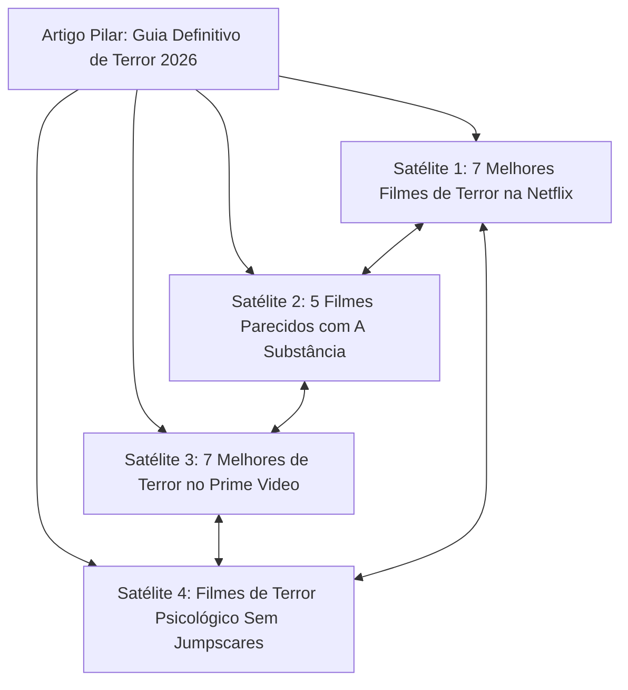

# 🏆 ESTRATÉGIA DE CONTEÚDO & SEO TÉCNICO DE OURO — FILMEJÁ (2026)

Este documento registra a estratégia editorial e de SEO técnico de alta conversão do **FilmeJá (filmeja.com.br)**, baseada em inteligência de dados de busca do mercado brasileiro (Semrush 2026) e diretrizes oficiais de indexação do Google.

---

## 📊 1. O Diagnóstico do Mercado Brasileiro (Dados Semrush 2026)

| Termo de Busca (Brasil) | Volume Mensal Estimado | Tipo de Intenção | Nível de Concorrência |
| :--- | :--- | :--- | :--- |
| **"filmes e séries novas"** | **2.240.000** | Descoberta / Streaming | Altíssima (Big Portals) |
| **"filmes"** | **450.000** | Navegacional / Genérico | Inacessível no início |
| **"filmes em cartaz"** | **450.000** | Cinema / Local | Alta |
| **"elenco de [Obra]"** | **301.000+** | Informacional Específico | Média |
| **"filmes de terror"** | **135.000** | Categoria Genérica | Alta |

> **O Fator AdoroCinema:** O AdoroCinema recebe cerca de **10,73 milhões de visitas/mês**, sendo **65,88% provenientes de tráfego orgânico do Google**. Isso comprova que a busca do Google ainda é a maior fonte de audiência cinematográfica da internet brasileira.

---

## 🎯 2. A "Armadilha" das Head Terms e a Estratégia dos Clusters

### O Erro Comum:
Tentar ranquear diretamente para `"filmes de terror"` ou `"melhores filmes"`. Portais gigantes com 20 anos de domínio (AdoroCinema, Omelete, UOL) dominam a primeira página.

### A Estratégia Vencedora do FilmeJá:
Em vez de atacar a palavra-chave genérica, atacamos **momentos específicos de decisão do usuário**, dividindo o site em **Topic Clusters (Artigos Pilares + Satélites)**.

* **Benefício para o Usuário:** Encontra exatamente o que assistir na plataforma que ele já assina.
* **Benefício para o Google:** Os links internos interligando os satélites constroem **Autoridade Tópica (Topical Authority)**, sinalizando ao algoritmo que o FilmeJá é especialista naquele nicho.

---

## 📝 3. As 6 Fórmulas de Títulos de Ouro do FilmeJá

A fórmula mestre recomendada para os títulos é:
$$\text{[Número]} + \text{[Gênero/Necessidade]} + \text{[Plataforma/Contexto]} + \text{[Benefício]} + \text{[Ano]}$$

### 🥇 Fórmula 1: Escolha Imediata por Plataforma
* **Gatilho:** A pessoa está no sofá com a TV ligada e não quer perder 40 minutos rolando catálogo.
* **Padrão:** `[X] Melhores Filmes de [Gênero] na [Netflix/Prime Video/Max] para Assistir Hoje em 2026`
* **Exemplo real:** *"7 Melhores Filmes de Terror na Netflix para Assistir Hoje em 2026"*

### 🥈 Fórmula 2: Pós-Sucesso ("Filmes Parecidos Com")
* **Gatilho:** O espectador acabou de assistir a um filme marcante e quer a mesma sensação.
* **Padrão:** `5 Filmes Parecidos com [FILME] para Assistir Depois`
* **Exemplo real:** *"5 Filmes Parecidos com A Substância para Assistir Depois"*
* **Potencial:** Altíssima taxa de cliques (CTR) e concorrência menor.

### 🥉 Fórmula 3: Filme em Alta / Validação de Tempo
* **Gatilho:** O filme está no Top 10 semanal ou viralizou no TikTok e a pessoa quer saber se vale o tempo dela.
* **Padrão:** `[FILME] (Ano) Vale a Pena? Review Sincera Sem Spoilers`
* **Exemplo real:** *"Rebelião (2024) Vale a Pena na Netflix? Review Sem Spoilers"*

### 🏅 Fórmula 4: Subgênero Hiper-Específico
* **Gatilho:** Busca por experiências muito particulares sem clichês.
* **Padrão:** `[X] Filmes de [Subgênero] que Realmente Prendem do Início ao Fim`
* **Exemplo real:** *"10 Filmes de Terror Psicológico que Realmente Prendem do Início ao Fim"*

### 🏅 Fórmula 5: Pós-Exibição / Explicação de Enredo
* **Gatilho:** Filmes com finais abertos ou enredos enigmáticos geram buscas imediatas no celular.
* **Padrão:** `Final de [FILME] Explicado: O Que Realmente Aconteceu no Desfecho?`
* **Exemplo real:** *"Final de Longlegs Explicado: O Segredo das Bonecas e o Vínculo Mortal"*

### 🏅 Fórmula 6: Descoberta Semanal / Google Discover
* **Gatilho:** Usuários do Google Discover na sexta-feira procurando lançamentos.
* **Padrão:** `7 Melhores Filmes Novos para Assistir no Fim de Semana no Streaming`

---

## 🔗 4. Regras de Ouro de Linkagem Interna (Internal Linking)

1. **Cada novo satélite DEVE conter link para seu artigo pilar** (via `reviewSlug` ou texto âncora natural).
2. **Cada review individual DEVE linkar para pelo menos 1 lista "Parecidos com"**.
3. **Todo link deve ter texto âncora contextual** (ex: *"veja também nossa crítica de A Substância"* em vez de *"clique aqui"*).
4. **Sem páginas órfãs:** Nenhum artigo pode existir sem ser citado por pelo menos outros 2 artigos do acervo.

---

## 👤 5. Personas Editoriais e Voz de Autoridade (E-E-A-T)

O Google valoriza conteúdo assinado por pessoas com perspectiva autêntica:

* **Lucas Andrade:** Crítico Sênior (Horror de Autor, Cinema Gótico, A24, Robert Eggers).
* **Beatriz Silveira:** Especialista em Cinema de Gênero (Slasher, Body Horror, Possessões).
* **Guilherme Santos:** Editor de Thrillers & Policiais (Neo-Noir, Whodunit, David Fincher).
* **Camila Fontes:** Crítica de Sci-Fi & Fantasia (Viagem no Tempo, IA, Denis Villeneuve).
* **Thiago Rocha:** Editor de Cinema Comercial & Ação (Adrenalina, Sobrevivência, Blockbusters).

---

## 🤖 6. Esteira de Publicação Diária

* **Script Python:** `scripts/gerador_filmeja.py` (com suporte a lotes, autores automáticos e fotos reais TMDB HTTP 200).
* **Atalho Windows:** `publicar_post.bat` (1 clique para gerar, commitar e subir para Vercel).
* **Zero Cota Vercel:** Imagens configuradas com `unoptimized: true` para puxar direto do CDN mundial sem erro 402.
